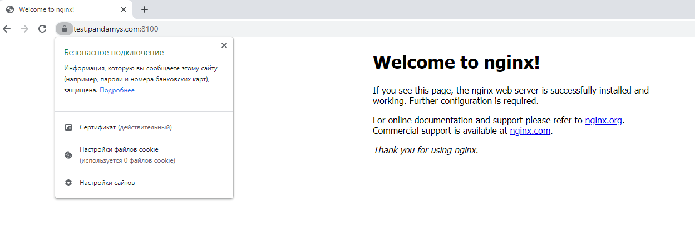

#Курсовая работа

##Настройка ufw

Разрешаем только https и ssh
```
sudo ufw default deny incoming
sudo ufw default allow outgoing

ufw allow in on eth0 to any port https
ufw allow in on eth0 to any port ssh
```

##Настройка CA и выпуск сертификата

Поднимаем CA
```
screen
vault server -dev -dev-root-token-id root
export VAULT_ADDR=http://127.0.0.1:8200
export VAULT_TOKEN=root

vault secrets enable pki
vault secrets tune -max-lease-ttl=87600h pki

vault write -field=certificate pki/root/generate/internal \
     common_name="pandamys.ru" \
     ttl=87600h > CA_cert.crt

vault write pki/config/urls \
     issuing_certificates="$VAULT_ADDR/v1/pki/ca" \
     crl_distribution_points="$VAULT_ADDR/v1/pki/crl"
```

Сразу добавляем CA в доверенные
```
cp CA_cert.crt /usr/local/share/ca-certificates/
update-ca-certificates
```

Поднимаем промежуточный CA
```
vault secrets enable -path=pki_int pki
vault secrets tune -max-lease-ttl=43800h pki_int
vault write -format=json pki_int/intermediate/generate/internal \
     common_name="pandamys.com Intermediate Authority" \
     | jq -r '.data.csr' > pki_intermediate.csr
vault write -format=json pki/root/sign-intermediate csr=@pki_intermediate.csr \
     format=pem_bundle ttl="43800h" \
     | jq -r '.data.certificate' > intermediate.cert.pem
vault write pki_int/intermediate/set-signed certificate=@intermediate.cert.pem
```

Добавляем роль
```
vault write pki_int/roles/pandamys-dot-com \
     allowed_domains="pandamys.com" \
     allow_subdomains=true \
     max_ttl="720h"
```

Выпускаем сертификат
```
vault write -format=json pki_int/issue/pandamys-dot-com \
    common_name="test.pandamys.com" \
    alt_names="test.pandamys.com" \
    ttl="30d" > server.crt
```

##Настройка nginx

Устанавливаем nginx
```
apt install nginx
```

Собираем из наших файлов цепочку сертификатов и приватный ключ
```
cat server.crt | jq -r .data.certificate > server_crt.crt
cat server.crt | jq -r .data.issuing_ca >> server_crt.crt
cat CA_cert.crt >> server_crt.crt
cat server.crt | jq -r .data.private_key > server_secret.key
```

Копируем всё в папку с nginx
```
mkdir /etc/nginx/ssl
cp server_* /etc/nginx/ssl
chmod 400 /etc/nginx/ssl/server_secret.key
```

Редактируем конфиг nginx
```
nano /etc/nginx/sites-available/default
...
server {
    listen              443 ssl;
    server_name         test.pandamys.com;
    ssl_certificate     /etc/nginx/ssl/server_crt.crt;
    ssl_certificate_key /etc/nginx/ssl/server_secret.key;
    ssl_protocols       TLSv1.1 TLSv1.2;
    ssl_ciphers         HIGH:!aNULL:!MD5;

    root /var/www/html;

   # Add index.php to the list if you are using PHP
   index index.html index.htm index.nginx-debian.html;
}
...
```

Добавляем на проверочной машине ЦА в доверенные и проверяем сайт.



##Автоматизируем выдачу сертификата

Скрипт для запроса сертификата и подмены в nginx
```bash
#!/bin/bash

export VAULT_ADDR=http://127.0.0.1:8200
export VAULT_TOKEN=root

name_server=$1
ttl_server="30d"
dir_cert_nginx="/etc/nginx/ssl"
file_for_cert="/tmp/server.crt"

echo $1 > /tmp/test
echo $file_for_cert >> /tmp/test

`vault write -format=json pki_int/issue/pandamys-dot-com \
    common_name="${name_server}" \
    alt_names="${name_server}" \
    ttl="${ttl_server}" > "$file_for_cert"`

cat "$file_for_cert" | jq -r .data.certificate > /tmp/server_crt.crt
cat "$file_for_cert" | jq -r .data.issuing_ca >> /tmp/server_crt.crt
cat /usr/local/share/ca-certificates/CA_cert.crt >> /tmp/server_crt.crt
cat "$file_for_cert" | jq -r .data.private_key > /tmp/server_secret.key

if [[ ! -d "$dir_cert_nginx" ]]; then
    mkdir $dir_cert_nginx
fi

cp /tmp/server_* /etc/nginx/ssl
chmod 400 /etc/nginx/ssl/server_secret.key

systemctl reload nginx
```

Добавляем задание в крон каждый месяц в 5 число в 5 часов 5 минут.
Если есть ошибки, то записываем их в файл лога.
```
crontab -e
5 5 5 * * /usr/local/scripts/request_cert.sh "test.pandamys.com" >> /tmp/script.log 2>&1
```