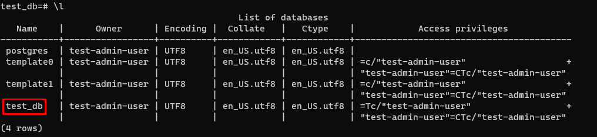
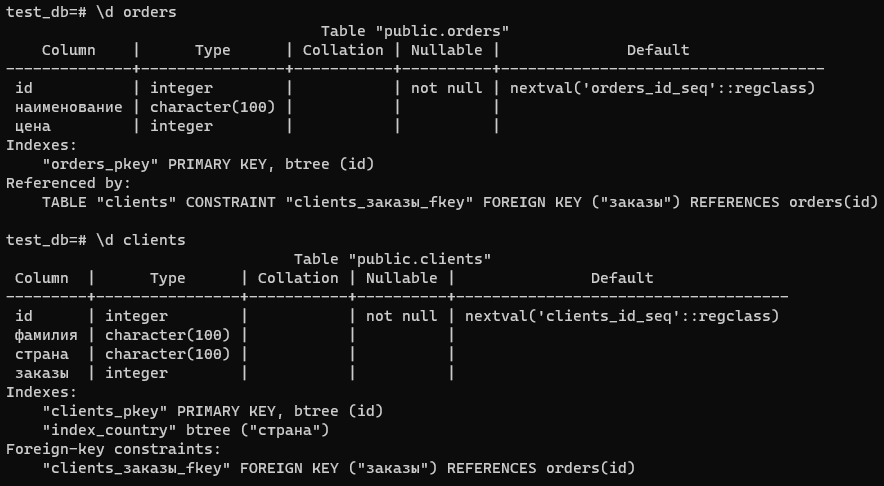
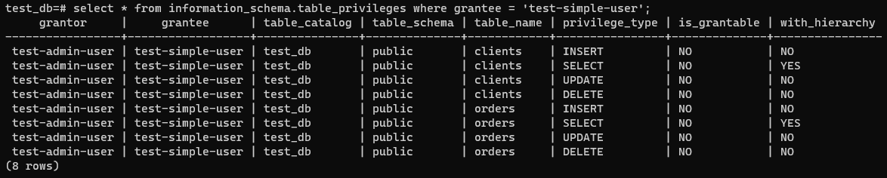
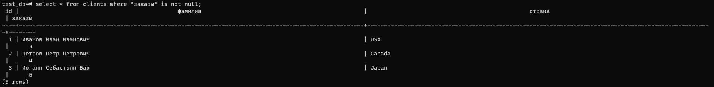

# Задание 1
```doctest
version: "2.2"
services:
  postgres:
    image: postgres:12
    environment:
      POSTGRES_DB: "test_db"
      POSTGRES_USER: "test-admin-user"
      POSTGRES_PASSWORD: "pgpwdtest"
      PGDATA: "/var/lib/postgresql/data/pgdata"
    volumes:
      - /var/lib/postgresql/data:/var/lib/postgresql/data
      - /opt/pg_backup:/opt/pg_backup
    ports:
      - "5432:5432"
```

# Задание 2




# Задание 3
```doctest
select count(*) from orders;
```
5
```
select count(*) from clients;
```
5

# Задание 4
```doctest
test_db=# update clients SET "заказы" = 3 where "фамилия" = 'Иванов Иван Иванович';
UPDATE 1
test_db=# update clients SET "заказы" = 4 where "фамилия" = 'Петров Петр Петрович';
UPDATE 1
test_db=# update clients SET "заказы" = 5 where "фамилия" = 'Иоганн Себастьян Бах';
UPDATE 1
```


# Задание 5
```doctest
test_db=# EXPLAIN select * from clients where "заказы" is not null;
                        QUERY PLAN
-----------------------------------------------------------
 Seq Scan on clients  (cost=0.00..10.90 rows=90 width=816)
   Filter: ("заказы" IS NOT NULL)
(2 rows)
```
Выполнен запрос через сканирование таблицы с таким-то фильтром

# Задание 6
Снимаем дамп
```
pg_dump -h 127.0.0.1 -p 5432 -U test-admin-user test_db -f /opt/pg_backup/test_backup
```
Восстанавливаем дамп
```doctest
psql -h 127.0.0.1 -d test_db -U test-admin-user < /opt/pg_backup/test_backup
```